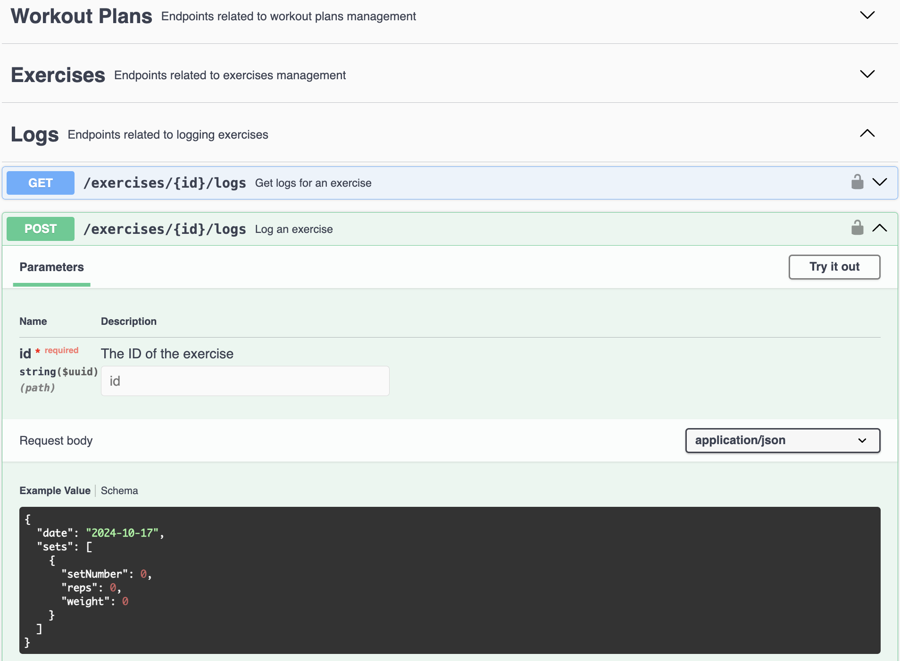

# Workout App API Backend

A Node.js Express TypeScript API for managing workout plans, exercises, and logs. It uses AWS Cognito for authentication and DynamoDB for scalable data storage.

## Features
- **AWS Cognito Authentication**: Secure user management with JWT tokens and Google Federated Login.
- **Workout Management**: Create workout plans, assign exercises, and log progress.
- **Custom Exercises**: Track sets, reps, weights, and dates for each exercise.
- **Scalable Storage**: DynamoDB ensures low latency and high availability with separate tables for workouts, exercises, and logs.
- **Multi-Environment**: Has dev,  qas, and prod environments.

## Technologies

This API uses several modern technologies to provide a fast, scalable, and secure solution:

- **TypeScript**: Type safety and easier code maintenance.
- **AWS Cognito**: JWT-based authentication, Google OAuth support.
- **AWS DynamoDB**: Serverless NoSQL database for storing data.
- **OpenAPI**: API documentation following OpenAPI specs.
- **Jest**: Testing framework for unit and integration tests.
- **Swagger**: Interactive API docs for local and dev environments.
- **Docker**: Containerization for consistent local development and environment deployment.
- **Terraform**: Manages AWS infrastructure as code.
- **GitHub Actions**: CI/CD pipeline for automated deployment.

## API Documentation Example

# Workout App API Frontend
wip 